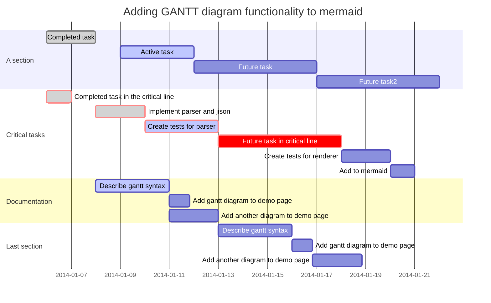

### Création d'une application Web avec Spring Boot avec JSP

#### Nous allons développer une application simple avec une fonctionnalité de connexion 
#### ainsi que la fonctionnalité permettant d'afficher une liste de tâches.
#### Nous suivrons le modèle MVC en utilisant JSP comme vue.

#### Nous avons mis en application :
- [x] amorcer un projet simple avec Spring Initializer
- [x] initialiser une application Web de base pour Spring Boot
- [x] ajouter une application JSP pour Web
- [x] construire une fonctionnalité de connexion de base
- [x] ajouter des fonctionnalités pour afficher une liste de tâches
- [x] connecter automatiquement des composants à l'aide de Spring Framework

### Les outils que nous avons utilisés
- [x] Maven 3.0+ est votre outil de construction
- [x] Votre IDE préféré. Nous utilisons Eclipse.
- [x] JDK 1.8+

### Vue d'ensemble de l'application Web
#### Nous allons construire une liste de tâches (non formatée) avec la fonctionnalité de connexion de base.

